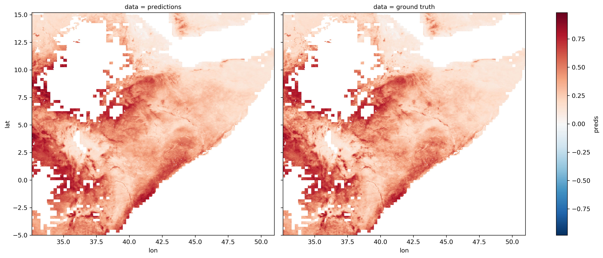

# Vegetation Health

Predicting vegetation health from precipitation and temperature

## Introduction

This repository experiments with different machine learning models to predict drought indices in East Africa 
(specifically the Normalized Difference Vegetation Index) using temperature and precipitation data.

## Results

Models are trained on data before 2016, and evaluated on 2016 data. Vegetation health in June is being predicted.

In addition, vegetation health can be hidden from the model to better understand the effects of the other features.

| Model                    | RMSE | RMSE (no veg) |
|:------------------------:|:----:|:-------------:|
|Linear Regression         |0.040 |0.084          |
|Feedforward neural network|0.038 |0.070          |
|Recurrent neural network  |0.035 |0.060          |

The results of the models can also be compared visually with the ground truths (the example below is from the baseline
logistic regression):



In addition, the effects of the inputs on the models' predictions are investigated using [shap values](https://github.com/slundberg/shap)
in Jupyter Notebooks, for both the [feedforward neural network](notebooks/04_gt_feedforward_model.ipynb) and the
[recurrent neural network](notebooks/08_gt_recurrent_model.ipynb).

## Pipeline

[Python Fire](https://github.com/google/python-fire) is used to generate a CLI.

### Data cleaning

Normalize values from the original csv file, remove null values, add a year series.

```bash
python run.py clean
```
A target can be selected by adding the flag `--target`, e.g. `--target=ndvi_anomaly`. 
By default, the target is `ndvi`. The selected target must be in 
[`predictor.preprocessing.VALUE_COLS`](predictor/preprocessing.py).

The original data is currently generated using datasets on the Oxford University cluster, using the scripts
in [`data`](data).

### Data Processing

Turn the CSV into `numpy` arrays which can be input into the model.

```bash
python run.py engineer
```

### Models

3 models have been implemented: a baseline linear regression, a feedforward neural network and a
recurrent neural network. They can be selected using the `--model_type` flag.

```bash
python run.py train_model
```

## Setup

[Anaconda](https://www.anaconda.com/download/#macos) running python 3.7 is used as the package manager. To get set up
with an environment, install Anaconda from the link above, and (from this directory) run

```bash
conda env create -f environment.yml
```
This will create an environment named `vegetation_health` with all the necessary packages to run the code. To 
activate this environment, run

```bash
conda activate vegetation_health
```

## Additional Notes

- The following variables are used by the model: `['lst_night', 'lst_day', 'precip', 'sm', 'ndvi', 'evi', 'ndvi_anomaly']`.
They are all from different sources


- East Africa is defined here as the area of the original `.nc` file (`spi_spei.nc`)
    
    lat min,  lat max : `-4.9750023`,  `15.174995`
    
    lon min, lon max : `32.524994`,  `48.274994`

    This makes the following bounding box: (left, bottom, right, top):  `(32.524994, -4.9750023, 15.174995, 48.274994)`
